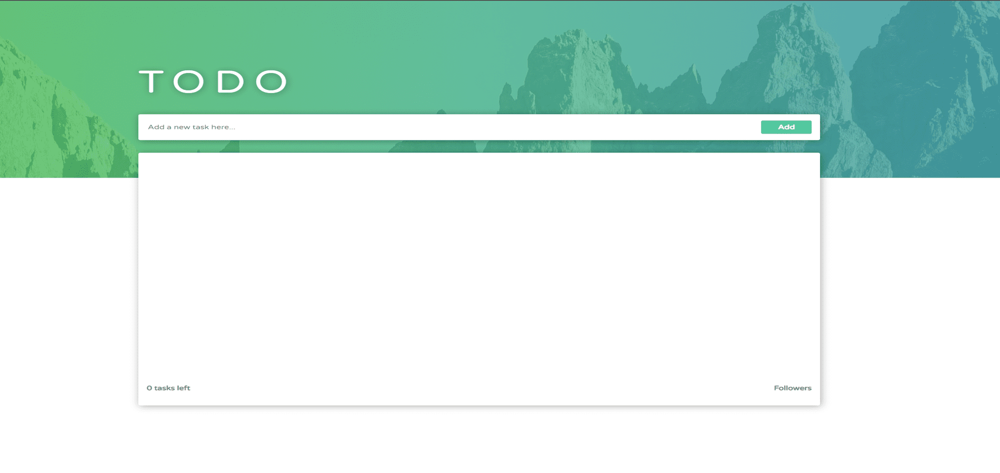

React Testing Library Demo App: Elevating Testing with React and Jest
=====================================================================  

[Live Website](https://utkarsh-react-testing-library-demo.netlify.app/)

The React Testing Library Demo App is a showcase of the power of React Testing Library and Jest for seamless unit and integration testing. This application is a Todo App built with ReactJS, designed to demonstrate best practices in testing front-end components.

## Key Highlights:  

* *Testing Expertise*: Explore the capabilities of React Testing Library and Jest in action, showcasing their effectiveness in testing React-based applications.  

* *Realistic Scenario*: The Todo App serves as a real-world scenario, allowing users to witness how these testing tools can ensure the functionality and reliability of an application.  

* *Unit and Integration Tests*: Dive into the world of unit and integration testing, witnessing how these tools can validate individual components and their interactions within the app.  

* *Testing Best Practices*: Learn about testing best practices, including how to write clean, efficient, and maintainable tests for React applications.  

The React Testing Library Demo App is a valuable resource for developers, QA engineers and anyone interested in improving the quality and reliability of React-based applications. It's an educational tool that demonstrates the importance of thorough testing and how to achieve it effectively with React Testing Library and Jest.  

  
